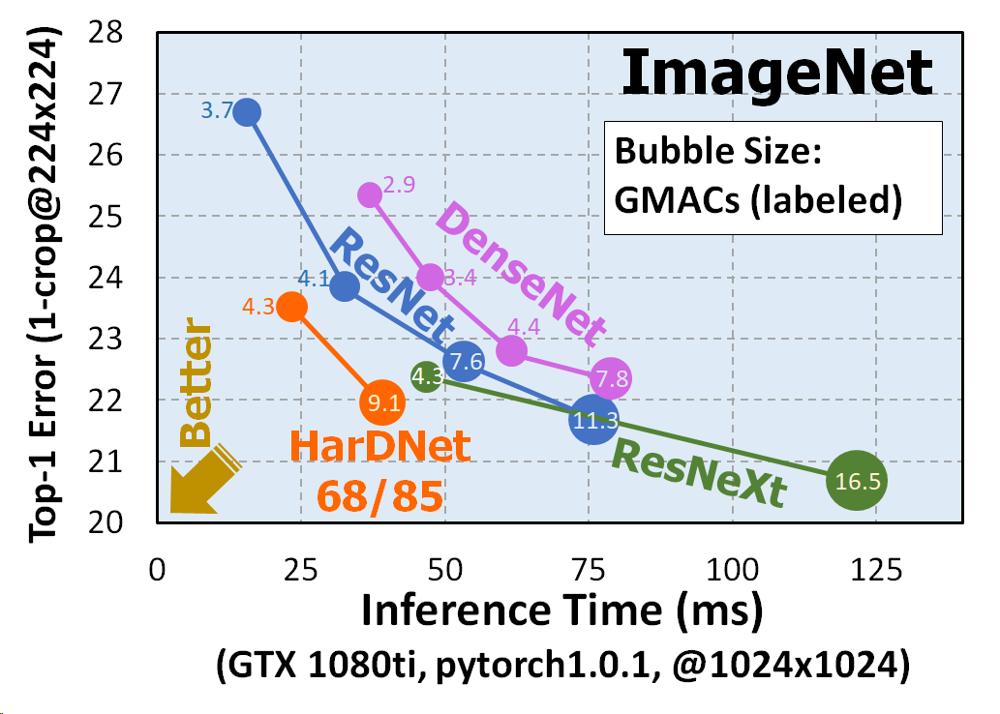
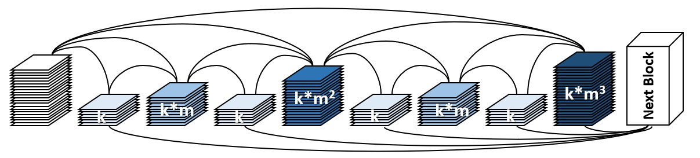
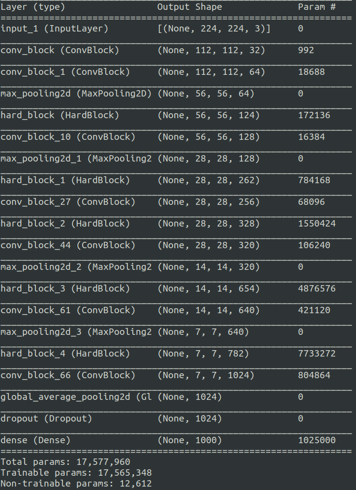

# Tensorflow implementation of [HarDNet: A Low Memory Traffic Network ( ICCV 2019 paper)](https://arxiv.org/abs/1909.00948)

## Key Points:

- Introdce memory traffic as a new metrics which should be taken into account when designing neural net for high resolution.
- Introduce CIO (Convolutonal Input and output) which is basically summation of input tensor size and output tensor size of every convolution layer.
- Avoiding layer with very low MoC like Conv 1x1 which has very large input/output channel ratio.
- Increases the computational density instead of memory density to fully utilize cuda cores.
 

  

---

## Architecture

 
  

    
  

- k is growth rate (similar to densenet)
- m is channel weighing factor ( 1.6~1.7)
- Conv-BN-ReLU
- 3x3 conv to all layers. 1x1 conv in just bottleneck and transition layers.
- Connect layer L to layer L-2n if 2n divides L, where n is a non-negative integer and L–2n ≥ 0.

 

  
   
  <em> Model Summary for HarDNet68</em>

## Reference

@misc{chao2019hardnet,
title={HarDNet: A Low Memory Traffic Network},
author={Ping Chao and Chao-Yang Kao and Yu-Shan Ruan and Chien-Hsiang Huang and Youn-Long Lin},
year={2019},
eprint={1909.00948},
archivePrefix={arXiv},
}
